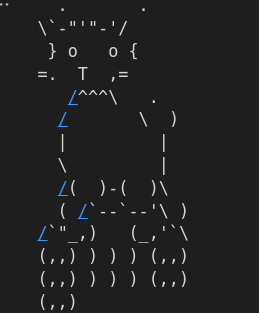

# This is a repo for me to learn how to finetune

1. First one is a fun one where I take a base model like Qwen3:1.7b and finetune it on ascii-art dataset. Used peft library and lora technique from it.
Here's the result:

